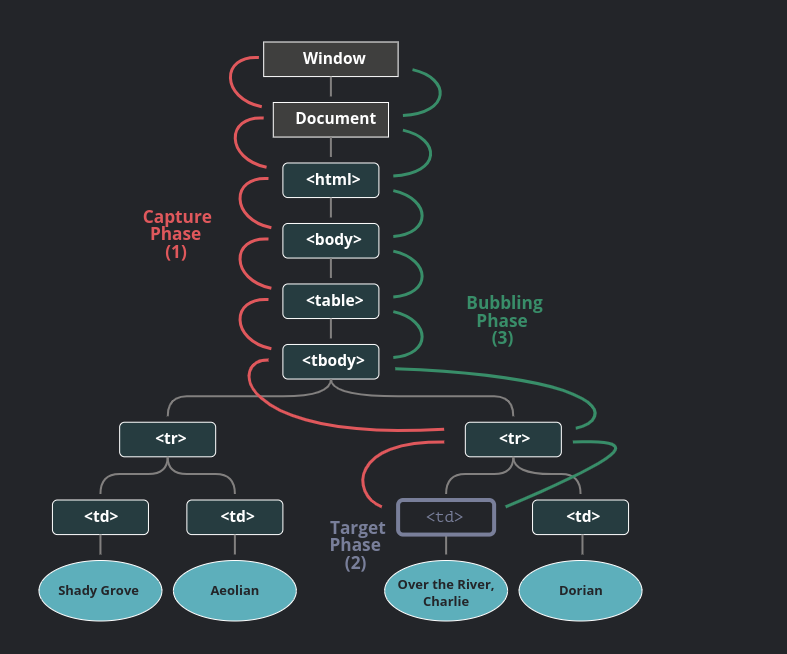
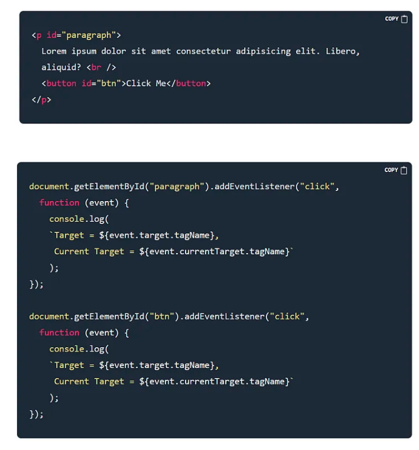

\ - 

### Capturing => Target => Bubbling

- Capturing: goes down to the elements.
- Target: reached and trigger event.
- Bubble: bubbles up from other elements.

===

# Event Binding

- CurrentTarget is element to which the event is attached. Never change noting.
- Target is element to which have activated event. It dependent exactly where user click.
  

# Bubbling

- Event bubbling is a concept in the Dom (Document Object Model).
  It happens when an element receives an event, and that event bubbles up
  (or you can say is transmitted(truyền đi) or propagated (truyền bá)) to
  its parent and ancestor elements in the DOM tree until it gets to root element.

- can you prevents:

  - stopPropagation():
    - The stopPropagation() method of the Event interface
      prevents further propagation (ngăn chặn sự lan truyền tiếp theo) of
      the current event in the Capturing and Bubbling phases.
  - preventDefault():
    - stop(cancel) those behaviors, prevent event Spread into elements remaining.
  - stopImmediatePropagation:
    - prevent other listeners is listening event called

# Capturing

\*(chụp / bắt được)

- The event goes down to the element

```
const elements = document.getBylElementId("container");
elements.addEventListener(callBackFn, {capture: true})

// or

elements.addEventListener(callBackFn, true)


* note:
    - if it's false(default), handle bubbling function.
    - if it's true, handle capturing function.
```
