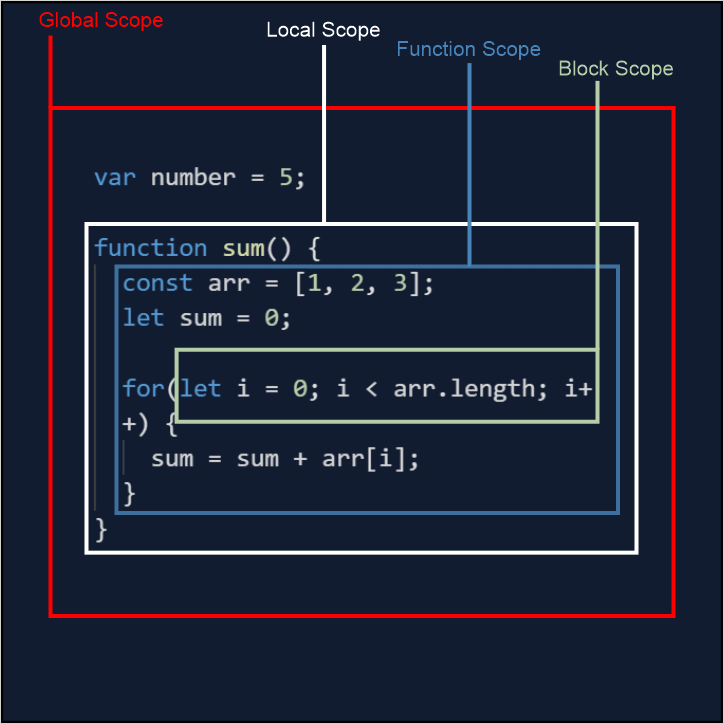

### Scope

- Scope

- Local Scope

- Global scope

- Function Scope

- Block Scope



### Scope In js

- Scope determines the accessibility (visibility) of variables.

- JavaScript has 3 types of scope:

  - Block scope

  - Function scope

  - Global scope

- One of the differences between var and let is :

  - var will have function scope whereas let will have block scope.

- Function scope is within the function.
- Block scope is within curly brackets.

  ```
  var character4 =
    function foo() {
        if(true) {
            var character1 = "Robin" //function scope
            let character2 = "Ted" //block scope
            const character3 = "Barney" //block scope
        }
        console.log(character1) //Robin
        console.log(character2) //not defined
        console.log(character3). //not defined
    }
  ```

- Global Scope: Variables declared Globally (outside any function) have Global Scope.

- Global variables can be accessed from anywhere in a JavaScript program.

- Another is the Local Scope, variables declared inside the functions are considered to be of the local scope and it is further divided into function scoped and block scoped.

- Function Scope: When a variable is declared inside a function, it is only accessible within that function and cannot be used outside that function.

- Block Scope: A variable when declared inside the if or switch conditions or inside for or while loops, are accessible within that particular condition or loop. To be concise, the variables declared inside the curly braces are called within the block scope.
