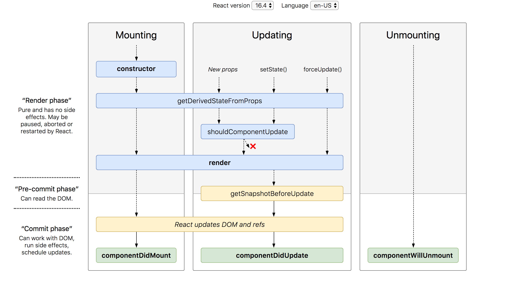

### Life cycle

- A component mounts when it’s added to the screen.
- A component updates when it receives new props or state, usually in response to an interaction.
- A component unmounts when it’s removed from the screen.



````
const serverUrl = 'https://localhost:1234';

function ChatRoom({ roomId }) {
  useEffect(() => {
    const connection = createConnection(serverUrl, roomId);
    connection.connect();
    return () => {
      connection.disconnect();
    };
  }, [roomId]);
  // ...
}```
````
